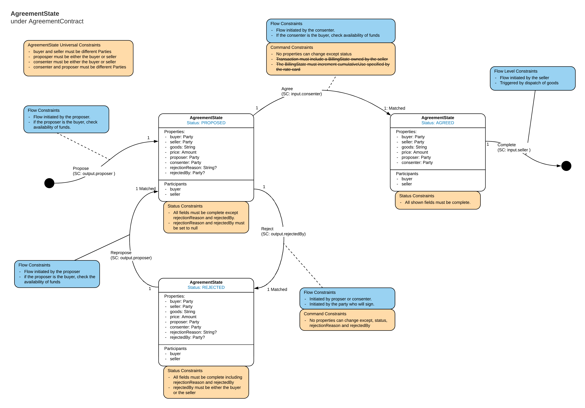
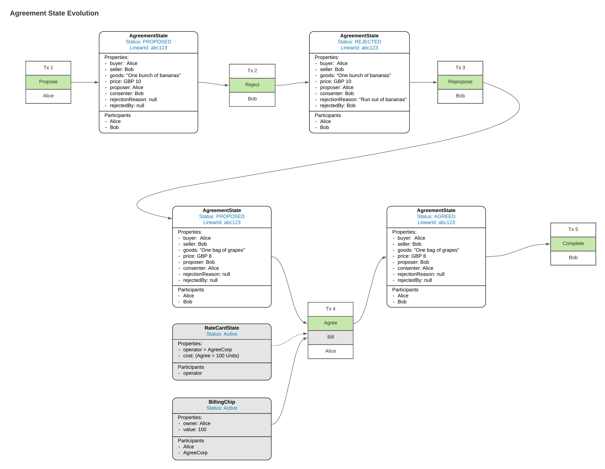

<p align="center">
  
</p>

# CorDapp Design Language (CDL) - Example CorDapp

This CorDapp provides an example implementation of a CDL design for two Parties to come to an agreement over the purchase of some goods. 

The intention is to take a mid level complexity CDL design and show how it can be methodically translated into the States and Contract required to implement the design.


# Important Caveat

This cdl-example CorDapp is not an R3 product. It is only an illustration of one way a CDL Smart Contract view could be implemented. It has not gone through R3's normal rigorous Product and QA procedures and should not be relied on as production grade code.


# CDL

## CDL Smart Contract view

The Smart Contract design can be articulated using the Smart Contract CDL view, this replaces and enhances the old State Machine view. 

The Agreement Smart Contract can be represented as follows:



Note, the strikethrough command constraint on the Agree Command concerns Billing which has not been implemented yet. 

## CDL Ledger Evolution view

The Ledger Evolution view replaces the old State Evolution view. The Ledger Evolution view represents part of the ledger as a Directed Acyclic Graph (DAG). This is helpful for tracing privacy implications and should give a more intuitive view of how the ledger can evolve.

An example of how the Agreement Smart contract might evolve on the ledger can be represented as follows:




Note, the greyed out states concerns Billing which has not been implemented yet. 

This particular evolution (Propose, Reject, Repropose, Agree, Complete) is used as the base happy path case in the unit tests and most of the test cases follow this order, see `/contracts/AgreementContractTests.kt`

# Approach for converting the CDL into Contract Code

## 'Sub' verify functions for each Constraint

As smart Contracts become more complicated, the risk of missing some important control grows. To reduce this risk the smart contract is split up into sub-verify functions which each deal with one of the types of constraints defined in CDL Smart Contract view. (With the exception of the blue Flow constraints which are not implemented in the Contract and are more notes on what the Flows should be doing.) 

```kotlin
    override fun verify(tx: LedgerTransaction) {

        verifyPathConstraints(tx, AgreementState::class.java)
        verifyUniversalConstraints(tx)
        verifyStatusConstraints(tx)
        verifyLinearIDConstraints(tx)
        verifySigningConstraints(tx)
        verifyCommandConstraints(tx)
    }
```

By splitting the verification into the sub-verify functions there is some duplication, eg multiple `when` statements on `command.value`, but the principle is that it is better to have some duplication if it allows better clarity and structure of the Smart Contract because this reduces the risk of making mistakes.

## Standardised mechanisms to implement each type of constraint 

For each sub-verify function we aim for a standard structure to implement that type of constraint. The idea being that any Cordapp should be able to follow the same structure and just change the details of the conditions. For example, the code for verifying Status constraints is as follows: 

```kotlin
    fun verifyStatusConstraints(tx: LedgerTransaction){

        val allStates = tx.inputsOfType<AgreementState>() + tx.outputsOfType<AgreementState>()

        for (s in allStates) {
            when(s.status){
                PROPOSED -> {
                    requireThat {
                        "When status is Proposed rejectionReason must be null" using (s.rejectionReason == null)
                        "When status is Rejected rejectedBy must be null" using (s.rejectedBy == null)
                    }
                }
                REJECTED -> {
                    requireThat {
                        "When status is Rejected rejectionReason must not be null" using (s.rejectionReason != null)
                        "When status is Rejected rejectedBy must not be null" using (s.rejectedBy != null)
                        "When the Status is Rejected rejectedBy must be the buyer or seller" using (listOf(s.buyer, s.seller).contains(s.rejectedBy))
                    }
                }
                AGREED -> {}
            }
        }
    }
```
Which can be generalised to be applicable for any CorDapp which uses statuses: 

```kotlin
    fun verifyStatusConstraints(tx: LedgerTransaction){

        val allStates = tx.inputsOfType<MyState>() + tx.outputsOfType<MyState>()

        for (s in allStates) {
            when(s.status){
                MY_STATUS_1 -> {
                    requireThat {
                        // Checks on states in status MY_STATUS_1
                    }
                }
                MY_STATUS_2 -> {
                    requireThat {
                        // Checks on states in status MY_STATUS_2
                    }
                }
            }
        }
    }
```

## Generic functionality moved to ContractUtils

To support standardised mechanics for each sub-verification, the implementation has been split between:

- Verify/ sub-verify functions which are simple, formulaic and approximate a configuration file, and
- ContractUtils which provides a set of helper function for use in the verify function that performs the heavy lifting, particularly around Paths and PathConstraints. It is intended to be generic and reuseable for multiple Smart contracts.

## Testing

Each sub verify has a set of unit tests which follow the base happy path, but introduce errors which ensure the contract validations fail in the correct way. 

The ContractUtils has its own set of tests which test more complicated uses of the Path and PathConstraints. 


# New concepts

As part of the implementation we introduce some new concepts:  
 
### StatusStates and Status interfaces

A core element of the CDL Smart Contract view is that Corda States can be in different statuses. When in different statuses there are different restrictions on the form of the state and the transitions that state can make.


Contract States which require a status property should implement the `StatusState` interface. This requires `val status: Status?` to be implemented by the Contract State.

`status` is nullable because we want to be able to represent no State as a status `null`. For example, when defining Paths allowed in transactions which have no input state we define the input status as null and map null -> allowed Paths.

```kotlin
/**
 * The StatusState interface should be implemented for all Contract states that require a status field.
 */
interface StatusState: ContractState {
    val status: Status?
}

/**
 * Statuses are defined as enum classes in the StatusState which should implement this Status interface.
 */
@CordaSerializable
interface Status


```
Statuses are defined in the StatusState as an enum class implementing the Status interface. 
 
```kotlin
data class AgreementState(override val status: AgreementStatus?,
                           //.../// 
                          override val participants: List<AbstractParty> = listOf(buyer, seller),
                          override val linearId: UniqueIdentifier = UniqueIdentifier()) : LinearState, StatusState

enum class AgreementStatus: Status{
    PROPOSED,
    REJECTED,
    AGREED
}

```
 
## Primary State (might want a better name)

For convenience in these explanations, we define the 'Primary' States as States of type `StatusState` which are the main concern of the CDL diagram. Ie, it is the statuses of the Primary State which are shown in the different boxes on the CDL Smart Contract diagram. In this CorDapp it is the AgreementState.

We also mandate that:

- if there are multiple Primary State inputs they must have the same status. 
- if there are multiple Primary State outputs, they must have the same status, which can be different from the Primary State Input's status.

There can be other states in the transaction, we will refer to those as 'Additional' states. 

The state that is considered Primary depends on the perspective of the CDL diagrams and the implementation. If two Smart Contracts are interacting, for example, this Agreement Smart Contract state and a Billing Smart Contract, then each would have its own CDL diagram and Smart Contract implementation. For the Agreement Smart Contract the Agreement States would be considered Primary with the Billing States being 'Addtional', where as for the Billing Smart Contract the Billing States would be considered Primary with the Agreements states being 'Additional'

 
## Paths

A Path represents the transition that a state makes from a given input Status within a specific transaction. Path is implemented as follows:

```kotlin
class Path<T: StatusState>(val command: CommandData,
                val outputStatus: Status?,
                val numberOfInputStates: Int,
                val numberOfOutputStates: Int,
                val additionalStates: Set<AdditionalStates> = setOf())

class AdditionalStates(val type: AdditionalStatesType, val clazz: Class<out ContractState>, val numberOfStates: Int)

enum class AdditionalStatesType {INPUT, OUTPUT, REFERENCE}
```
Where: 
- `command` represents the command.value in the transaction which relates to the Primary State's Contract (there could be other commands in the transaction but they are not dealt with by Paths). 
- `outputStatus` represents the status of the output Primary State. it will be null if there is no output state.
- `numberOfInputStates` represents the number of States of the Primary State type in the transaction. 
- `numberOfOutputStates` represents the number of States of the Primary State type in the transaction. 
- `additionalStates` represents States types other than the Primary States type which are in the transaction, including whether they are inputs, outputs or reference states and how many of each are in the transaction. 

In this CorDapp:

- `numberOfInputStates` and `numberOfOutputStates` are going to be set to 0 or 1, because for any given agreement we only want to have a maximum of one AgreementState unconsumed at any point in time representing the latest state of this agreement. However, in other use cases there could be different Multiplicities involved.
- `additionalStates` will be used to represent the BillingChips required in the Agree Paths (Although this is not implemented yet).


## PathConstraints

PathConstraints are used to restrict Paths that are allowed in a transaction. The Contract defines a set of PathConstraints for each Primary State status, for example when in status X you can follow PathConstraint A or B, but when you are in state Y you can only follow PathConstraint C.

In order to pass the verify the Path in the transaction needs to comply to at least one of the allowed PathConstraints for the Status of the Primary Input State. 

PathConstraints are implemented as follows: 


```kotlin
class PathConstraint<T: StatusState>(val command: CommandData,
                                     val outputStatus: Status?,
                                     val inputMultiplicityConstraint: MultiplicityConstraint = MultiplicityConstraint(),
                                     val outputMultiplicityConstraint: MultiplicityConstraint = MultiplicityConstraint(),
                                     val additionalStatesConstraints: Set<AdditionalStatesConstraint> =  setOf()){  

    infix fun allows(p: Path<T>): Boolean { ... }
    
    infix fun doesNotAllow(p: Path<T>): Boolean = !this.allows(p)

    private fun additionalStatesCheck(constraints: Set<AdditionalStatesConstraint>, additionalStates: Set<AdditionalStates>) :Boolean{ ... }
}


```
Where:
- `command` is the class of the command required.
- `outputStatus` is the outputStatus of the Primary State that is required.
- `inputMultiplicityConstraint` defines the range of number of inputs of Primary type that is required.
- `outputMultiplicityConstraint` defines the range of number of outputs of Primary type that is required.
- `additionalStatesConstraint` defines which additional states must be present in the transaction.

A Path will only be allowed by the PathConstraint if it passes all these requirements.

`additionalStatesConstraint` are implemented as follows:

```kotlin
class AdditionalStatesConstraint(val type: AdditionalStatesType ,
                                 val statesClass: Class<out ContractState>, 
                                 val requiredNumberOfStates: MultiplicityConstraint = MultiplicityConstraint()) {

    infix fun isSatisfiedBy(additionalStates: AdditionalStates ):Boolean {...}

    infix fun isNotSatisfiedBy (additionalStates: AdditionalStates): Boolean = !isSatisfiedBy(additionalStates)
}
```

where: 
- `type` is INPUT, OUTPUT or REFERENCE.
- `statesClass` is the required type of the additional states.
- `requiredNumberOfStates` defines how many AdditionalStates of this type are allowed using a `MultiplicityConstraint`.

`MultiplicityConstraint` are defined as follows:

```kotlin
class MultiplicityConstraint(val from: Int = 1, 
                             val bounded: Boolean = true, 
                             val upperBound: Int = from){

    infix fun allows(numberOfStates: Int): Boolean { ... }

    infix fun doesNotAllow(numberOfStates: Int): Boolean = !this.allows(numberOfStates)
}
```

where: 
- `from` is the minimum number of states.
- `bounded` specifies if there is an upper limit. 
- `upperbound` specifies the upperbound, which is only applied if `bounded` is true.

Note, the structure above allows for quite complex definition of what is allowed, in most cases these won't be needed. To simplify the use of PathConstraints most properties are defaulted. So for example you can specify a Path constraint simply as:

```kotlin
PathConstraint(Commands.Reject(), REJECTED)
```

which would default to 
- 1 Input of Primary State type
- 1 output Primary State type
- no additional states required

Or they could get much more complicated as in this example from the test scripts: 

```kotlin
PathConstraint(Commands.Command2(), TestState2A.TestStatus.STATUSA2, additionalStatesConstraints = setOf(
        AdditionalStatesConstraint(AdditionalStatesType.INPUT, TestState2B::class.java, MultiplicityConstraint(2, false)),
        AdditionalStatesConstraint(AdditionalStatesType.REFERENCE, TestState2C::class.java),
        AdditionalStatesConstraint(AdditionalStatesType.OUTPUT, TestState2D::class.java)
))


```

## Using Path Constraints in the Contract

The classes for Paths and PathConstraints are all provided in the ContractUtlis file, this means that the verifyPathConstraints() function is actually very simple to write:

```kotlin
    fun <T: StatusState> verifyPathConstraints(tx: LedgerTransaction, primaryStateClass: Class<T>){

        val commandValue = tx.commands.requireSingleCommand<AgreementContract.Commands>().value    // get the command

        val txPath = getPath(tx, primaryStateClass, commandValue)       // call the getPath() utility function to get the Path of the transaction

        val inputStatus = requireSingleInputStatus(tx, primaryStateClass)       // get the Primary state status

        val allowedPaths: List<PathConstraint<T>> = when (inputStatus){        // populate the when clause mapping: statuses -> allowed constraints
            null -> listOf(
                    PathConstraint(Commands.Propose(), PROPOSED, MultiplicityConstraint(0))
            )
            PROPOSED -> listOf(
                    PathConstraint(Commands.Reject(), REJECTED),
                    PathConstraint(Commands.Agree(), AGREED)
            )
            REJECTED -> listOf(
                    PathConstraint(Commands.Repropose(), PROPOSED)
            )
            AGREED -> listOf(
                    PathConstraint(Commands.Complete(), null, outputMultiplicityConstraint = MultiplicityConstraint(0))
            )
            else -> listOf()
        }

        requireThat {
            "txPath must be allowed by PathConstraints for inputStatus $inputStatus." using verifyPath(txPath, allowedPaths) // call the utility function to check the paths
        }
    }
```

Because a lot of the heavy lifting has be moved to the ContractUtils, this pattern can be replicated for other Contracts by substituting in the specific Statuses and the PathConstraints for each status.


The mechanism for Paths and Path Constraints can be represented in the the following diagram: 


There is an open question as to whether there should be an 'exclusive' flag on the Path Constraint, meaning that the only the States defined in the AdditionalStateConstraints may be present. Currently Path constraints allow any number of other State types not mentioned in the constraint, it will pass verification as long as the specified AdditionalStates are present.


# Build and deploy the Cordapp

The CorDapp is based of the Cordapp Template - Kotlin, so should behave in the normal way, eg `./gradlew deployNode` to build and start up the nodes.

Note, most of the testing of the smart contract is done using Contract Unit tests, the rest of the CorDapp is mostly not implemented yet:
- Only two flows are implemented (Propose and Reject) togther with basic flow tests for each, just to test that serialisation of the Classes works.
- The webserver is not implemented.
- The RPC client is not implemented.


